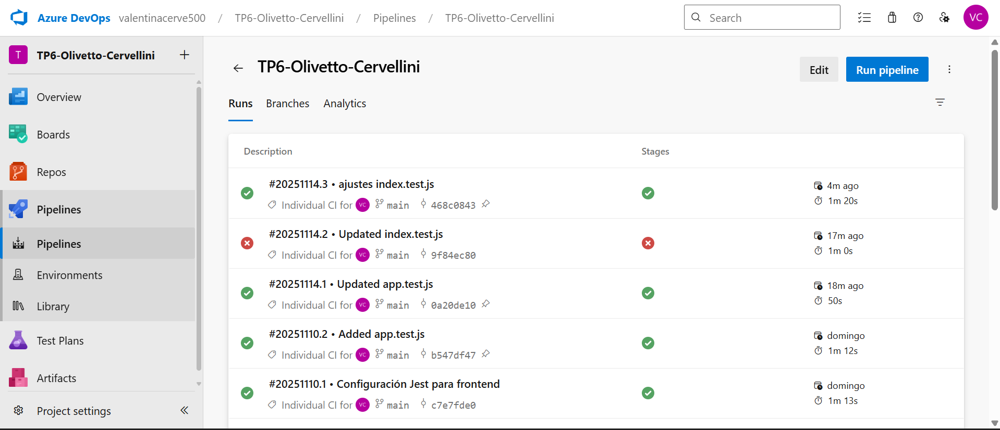

# Decisiones — Trabajo Práctico 6 — Ingeniería de Software 3

## 📌 1. Elección de Frameworks de Testing

### **Frontend – Jest**
- Se eligió **Jest** como framework principal de testing.
- Permite usar **jsdom** para simular el navegador sin necesidad de un entorno real.
- Es simple de configurar y muy usado en la comunidad.
- Se utilizó para probar la función de validación del frontend (`esPalabraValida`).

### **Backend – Jest + Supertest**
- El backend se testeó con:
  - **Jest** → motor de pruebas.
  - **Supertest** → permite testear endpoints HTTP sin levantar un servidor real.
- Permite validar la API como si un cliente real enviara requests.

---
## 📌 2. Decisiones sobre Mocking (Base de Datos)

### **Mock de sqlite3**
- Para evitar dependencias del sistema y acceso a archivos reales, se decidió:
  - **Mockear completamente `sqlite3` con Jest**.
- Motivos:
  - Tests más rápidos.
  - Tests determinísticos.
  - No se requiere `palabras.db` durante las pruebas.
  - Evita fallas en Azure DevOps.

El mock incluye:
- `new sqlite3.Database()`
- `db.run()`
- `db.all()`

---

## 📌 3. Estructura del Proyecto

```bash
TP6-Olivetto-Cervellini/
│
├── backend/
│   ├── index.js
│   ├── index.test.js
│   └── palabras.db
│
├── frontend/
│   ├── app.js
│   ├── app.test.js
│   ├── index.js
│   └── index.html
│
├── images/
│   └── (imágenes utilizadas en este documento)
│
├── decisiones.md
└── README.md
```

---

## 📌 4. Tests Implementados

### **Frontend (6 tests en total)**  
Archivo: `frontend/app.test.js`

Se probaron los siguientes comportamientos:

1. Rechazo de cadenas vacías o solo espacios.
2. Rechazo de palabras de un solo carácter.
3. Aceptación de palabras válidas de dos o más caracteres.
4. Aceptación de palabras con espacios al inicio o final.
5. Validación de que siempre se retorne un valor booleano.
6. Manejo correcto cuando la función recibe `undefined` o sin parámetros.

---

### **Backend (5 tests en total)**  
Archivo: `backend/index.test.js`

Casos probados:

1. **GET /health**  
   - Debe responder 200.  
   - Body con: `status`, `timestamp`, `environment`.

2. **POST /api/palabras sin campo palabra**  
   - Respuesta esperada: `400 { error: "La palabra es requerida" }`.

3. **POST /api/palabras con cadena vacía**  
   - Respuesta 400.

4. **POST /api/palabras solo con espacios**  
   - Respuesta 400.

5. **POST /api/palabras válida**  
   - Debe responder código 2xx.  
   - No debe incluir campo `error`.

---

## 📌 5. Ajustes en el Backend (para alinear lógica + tests)

Para que los tests reflejen comportamientos reales, se incorporaron validaciones adicionales en:

**POST `/api/palabras`**

Se decidió que:
- El campo `palabra` sea obligatorio.
- Se aplique `.trim()` para eliminar espacios.
- Debe tener mínimo 2 caracteres.
- Si alguna regla falla → `400` con un mensaje unificado:
  
## 📌 6. CI/CD en Azure DevOps
CI – Integración Continua
El pipeline se ejecuta automáticamente ante cada push a main.
Pasos de la pipeline:
- Checkout del repositorio.
- Instalación de Node.js.
- Instalación de dependencias en frontend y backend.
- Ejecución de tests unitarios.
- Publicación de resultados.
Resultados
Todos los tests están en verde.
La pipeline garantiza que cada cambio nuevo pase las pruebas obligatoriamente.


