# Decisiones — TP5

## 1. Configuración Inicial de Azure

1. Entrar al portal de Azure.  
2. Crear el resource group: `palabras-ingsoft3-2025`.  
3. Crear un App Service Plan llamado `plan-palabras-free` dentro del resource group creado.  
4. Crear las Web Apps (en el mismo RG y plan), con runtime Node 20‑lts:
   - `palabras-prod`  
   - `palabras-qa`

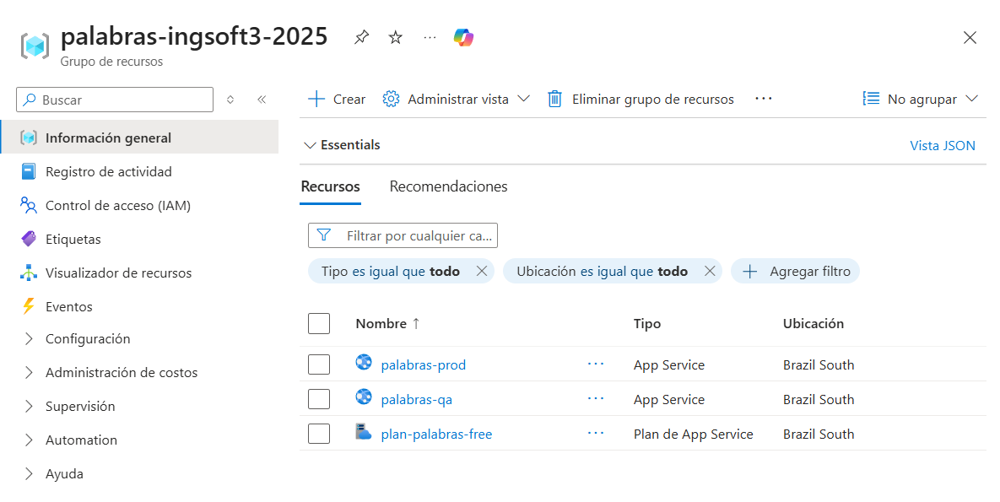

5. En el proyecto del TP4 en Azure DevOps crear un Service Connection <<azure-palabras-connection>> hacia el resource group creado.

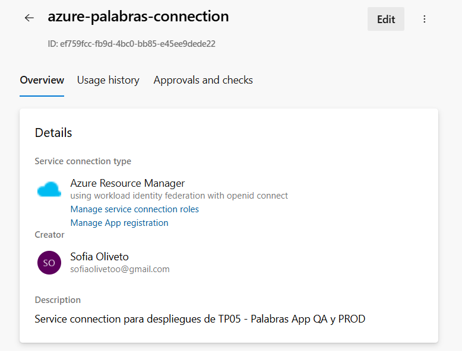  

Confirmar que la conexión aparece como colaborador en el resource group.  

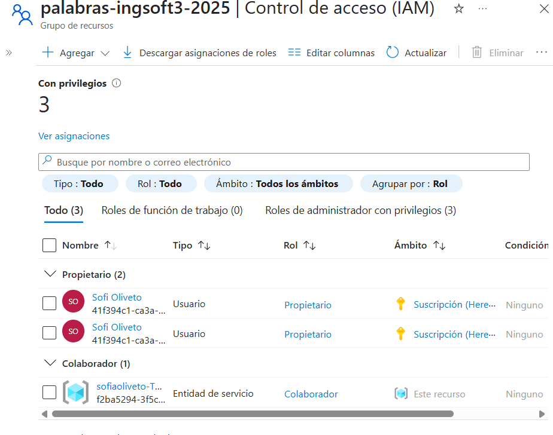

6. Probar la ejecución del pipeline `azure-pipeline.yml` del TP4 (asegurarse de que el self‑hosted agent esté levantado).

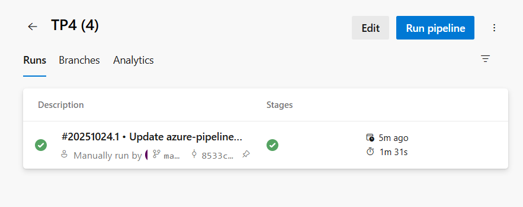

7. Crear environments: `QA` y `PROD`. 

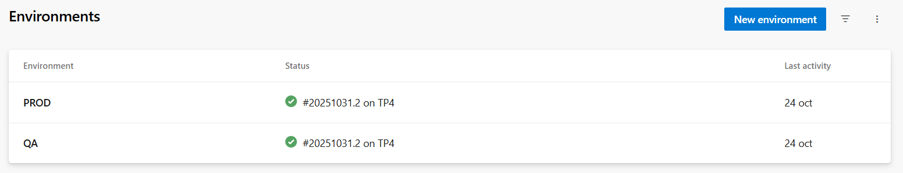 

8. Modificar el pipeline para incluir los requisitos nuevos:
   - Usar un agente de Azure (hosted agent).  
   - Ajustar stages/tasks según el despliegue a QA.

Verificar que el pipeline corre correctamente.  

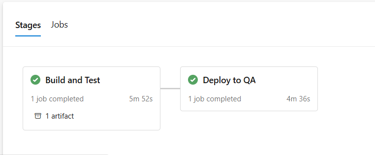

Confirmar que la Web App `palabras-qa` muestra la aplicación correctamente.  

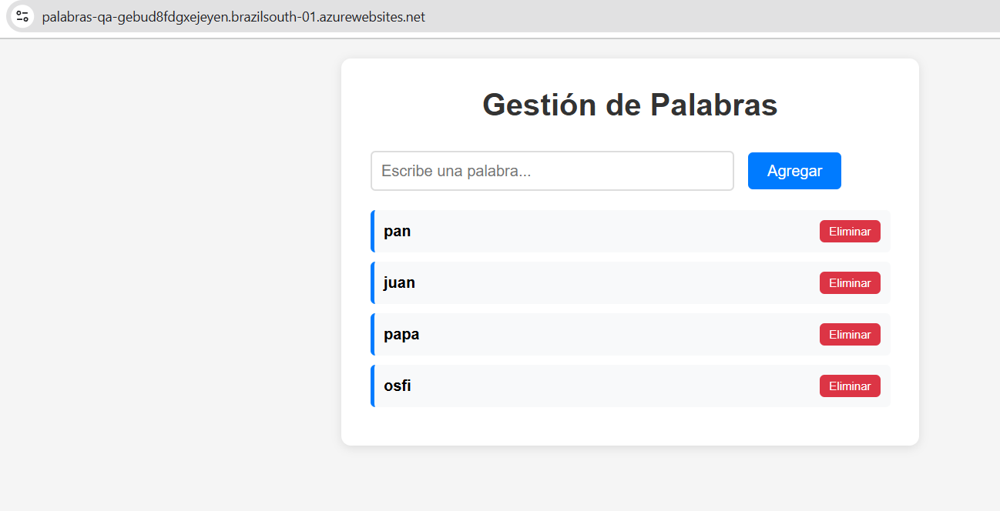

9. Configurar las aprobaciones necesarias del environment `PROD`.  

10. Modificar el pipeline para añadir el stage de `PROD` y las aprobaciones correspondientes.

Evidencias del despliegue y aprobaciones:

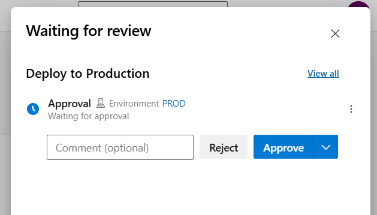

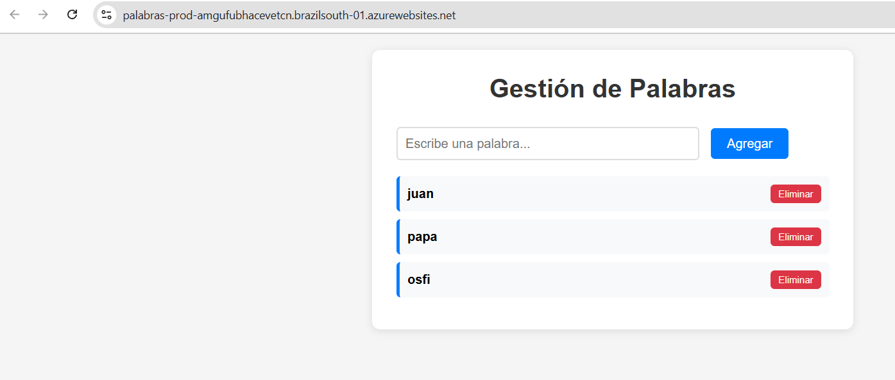

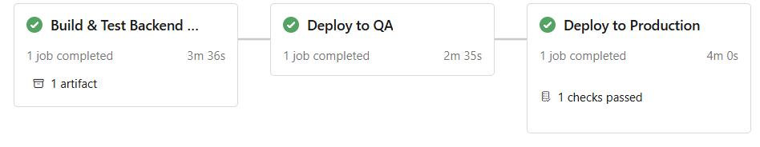

## 2. Arquitectura de Release Elegida

### Herramientas y Servicios Cloud Utilizados

**Azure DevOps Services:**
- **Azure Pipelines**: Para implementar CI/CD con stages diferenciados
- **Azure Repos**: Repositorio de código fuente
- **Environments**: QA y PROD con configuraciones específicas
- **Variable Groups**: `QA-Variables` y `PROD-Variables`
- **Service Connections**: Conexión segura a Azure Resource Group

**Azure Cloud Services:**
- **Azure App Service**: Hosting de aplicaciones web Node.js
- **Resource Group**: `palabras-ingsoft3-2025` para organización de recursos
- **App Service Plan**: `plan-palabras-free` para optimización de costos

**Justificación de la Arquitectura:**
- **Separación de entornos**: QA y PROD completamente aislados para testing seguro
- **Pipeline multi-stage**: Permite testing en QA antes de desplegar a producción
- **Hosted agents**: Mayor disponibilidad y mantenimiento automático vs self-hosted
- **App Service**: Plataforma managed que reduce overhead operacional

## 3. Configuración de Entornos y Variables

### Variables por Entorno

**Variables QA (`QA-Variables`):**
-ENVIRONMENT_NAME -> QA
-NODE_ENV -> qa
-DB_PATH -> ./palabras-qa.db

**Variables PROD (`PROD-Variables`):**
-ENVIRONMENT_NAME -> PROD
-NODE_ENV -> prod
-DB_PATH -> ./palabras-prod.db

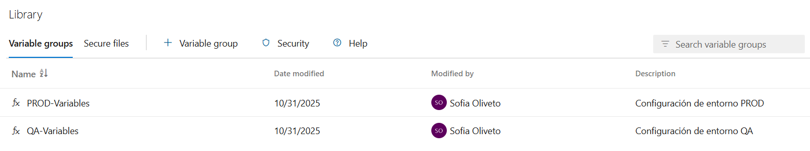 

## 4. Estrategia de Aprobaciones Implementada

### Configuración de Aprobaciones

**Environment QA:**
- **Sin aprobaciones manuales**: Despliegue automático tras successful build
- **Justificación**: Entorno de testing, necesita feedback rápido para desarrollo

**Environment PROD:**
- **Aprobación manual requerida**: Configurada en el environment PROD de Azure DevOps
- **Aprobadores**: [Lista de usuarios autorizados]
- **Timeout**: 30 días para aprobar o rechazar
- **Re-approval**: Requerida si hay cambios en el deployment